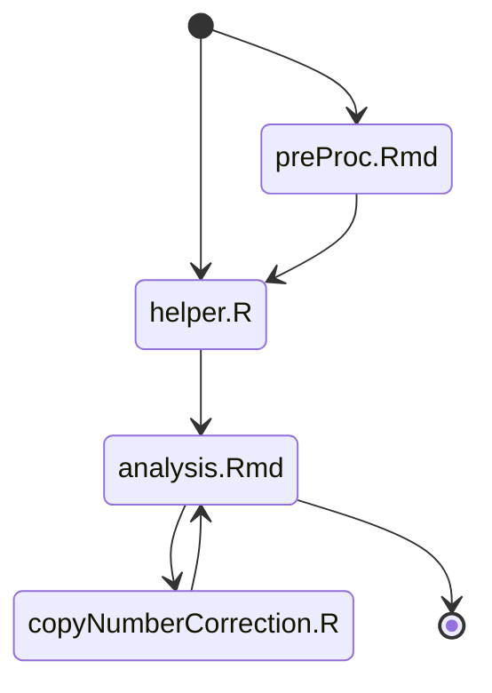

# SynComm1

Code to generate figures in the paper Synthetic Community 1

- Run `prepProc.Rmd`, if you want to generate the phyloseq object from the processed reads. If not, jump to the next step.
- Load in `helper.R`. This file loads in necessary environment variables and helper functions
- Run `analysis.Rmd`. This generates most figures in the paper, with the exception of the one generated outside of R, using https://itol.embl.de/

